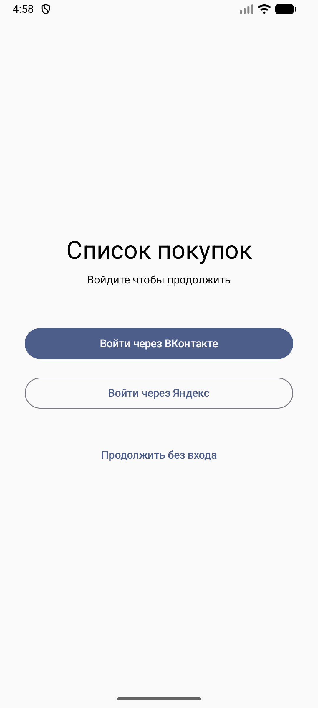
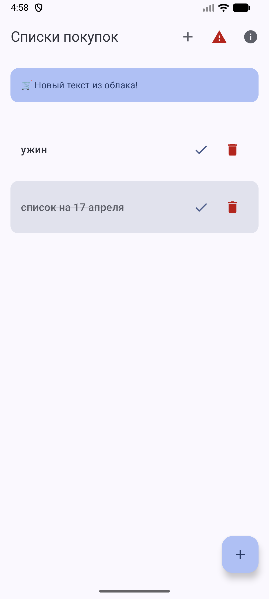
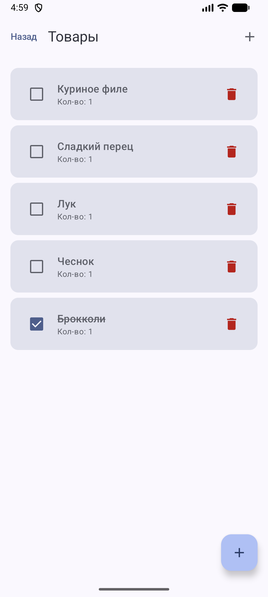
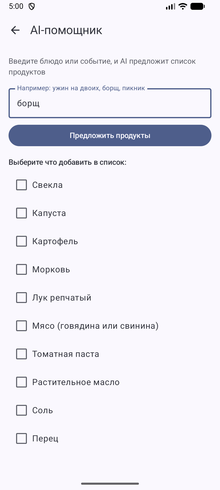
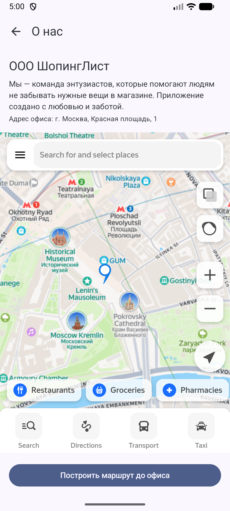

# Shopping List App 🛒

Мобильное приложение для управления списками покупок на Jetpack Compose + Kotlin.

## Скриншоты

| Авторизация | Списки | Товары | AI-помощник | О нас |
|:-----------:|:------:|:------:|:-----------:|:-----:|
|  |  |  |  |  |

## Функциональность

- Создание и управление списками покупок
- Добавление товаров с указанием количества
- Отметка купленных товаров
- Авторизация через VK и Яндекс ID
- AI-помощник: введи блюдо или событие — получи список продуктов
- Push-уведомления через Firebase FCM
- Карта с адресом офиса и маршрутом
- Профиль пользователя через Firestore

## APK

Скачать: [Releases](https://github.com/an4ek/Shopping-List/releases/tag/v1.0)

## Сборка

```bash
./gradlew assembleDevDebug
```

---

## Обязательные критерии

### 1. Чистая архитектура · 5 баллов

Проект разбит на 4 Gradle-модуля:

| Модуль | Назначение |
|--------|-----------|
| `:domain` | Чистый Kotlin без Android. Модели, интерфейсы репозиториев, Use Cases |
| `:data` | Room, реализации репозиториев, преобразование данных из БД в модели |
| `:core` | Базовая ViewModel с обработкой ошибок, вспомогательные классы |
| `:app` | Экраны на Compose, ViewModels, навигация, подключение зависимостей |

Правило: модули зависят только от более внутренних. `app` знает про `domain`, `data` знает про `domain`, но `domain` не знает ни про кого.

**Где смотреть:**
- Use Cases: `domain/src/main/kotlin/com/example/domain/usecase/`
- Интерфейсы репозиториев: `domain/src/main/kotlin/com/example/domain/repository/`
- Реализации репозиториев: `data/src/main/kotlin/com/example/data/repository/`
- Подключение зависимостей (Hilt): `app/src/main/kotlin/com/example/shoppinglistapp/di/`

**DI через Hilt** — все зависимости передаются через конструктор, Hilt сам создаёт нужные объекты.

---

### 2. Фоновые задачи и сервисы · 3 балла

**WorkManager** — периодическая синхронизация каждые 15 минут:
- Файл: `app/src/main/kotlin/com/example/shoppinglistapp/worker/SyncWorker.kt`
- Запускается только при наличии интернета
- Стартует автоматически при запуске приложения
- Не создаёт дубликаты если уже запущен

**BroadcastReceiver** — реакция на перезагрузку устройства:
- Файл: `app/src/main/kotlin/com/example/shoppinglistapp/receiver/BootReceiver.kt`
- Когда телефон перезагружается, заново запускает периодическую синхронизацию
- Зарегистрирован в `AndroidManifest.xml`

---

### 3. Анимации в Jetpack Compose · 2 балла

Файл: `app/src/main/kotlin/com/example/shoppinglistapp/ui/lists/ShoppingListScreen.kt`

**AnimatedVisibility** — промо-баннер:
- Баннер плавно появляется и исчезает при изменении настроек в Firebase Remote Config
- При появлении — плавное раскрытие сверху вниз
- При скрытии — плавное сворачивание

**animateColorAsState** — карточка списка:
- Когда список отмечается как завершённый, карточка плавно меняет цвет фона
- Пользователь видит мягкий переход цвета вместо резкого переключения

---

### 4. XML разметка и интеграция Compose · 2 балла

**XML layout:**
- Файл: `app/src/main/res/layout/activity_help.xml`
- Обычная XML-разметка с TextView и ComposeView внутри

**Activity:**
- Файл: `app/src/main/kotlin/com/example/shoppinglistapp/ui/help/HelpActivity.kt`
- Экран создаётся через XML (`setContentView`)
- Внутри XML находится ComposeView — в него вставляется Compose-контент
- Показывает инструкцию по использованию приложения

---

### 5. Gradle: конфигурация сборок · 2 балла

Файл: `app/build.gradle.kts`

**Два варианта приложения (productFlavors):**

| | dev | prod |
|--|-----|------|
| Для чего | Разработка и тестирование | Финальная версия |
| Адрес сервера | `https://dev.api.shoppinglist.com` | `https://api.shoppinglist.com` |

**Два типа сборки (buildTypes):**
- `debug` — для разработки, код не сжимается
- `release` — для публикации, R8 сжимает и оптимизирует код, делает его меньше

Итого 4 варианта сборки: `devDebug`, `devRelease`, `prodDebug`, `prodRelease`

---

### 6. Качество кода и UX · 1 балл

- Все операции в ViewModel обёрнуты в обработку ошибок через `launchSafe`
- При ошибке приложение не падает — ошибка фиксируется в Crashlytics и AppMetrica
- Экраны показывают три состояния: загрузка → данные / ошибка
- Пустой список — отдельное состояние с подсказкой

---

## Бонусные критерии

### Firebase · +2 балла

**FCM Push-уведомления:**
- Файл: `app/src/main/kotlin/com/example/shoppinglistapp/push/PushMessagingService.kt`
- Уведомления работают когда приложение открыто и когда свёрнуто
- Нажатие на уведомление открывает нужный экран приложения

**Remote Config:**
- Файл: `app/src/main/kotlin/com/example/shoppinglistapp/config/FirebaseRemoteConfigService.kt`
- Параметры в Firebase консоли: текст баннера и флаг показа промо
- Изменения применяются без перевыпуска приложения

**Firestore:**
- Файл: `app/src/main/kotlin/com/example/shoppinglistapp/firestore/FirestoreService.kt`
- Хранит профиль пользователя: имя, email, FCM-токен
- Обновляется в реальном времени
- Правила доступа: пользователь видит только свои данные

---

### Использование ИИ · +2 балла

**Gemini через OpenRouter API:**
- Сервис: `app/src/main/kotlin/com/example/shoppinglistapp/ai/GeminiService.kt`
- Экран: `app/src/main/kotlin/com/example/shoppinglistapp/ui/ai/AiSuggestScreen.kt`

**Сценарий использования:**
1. Открываешь список покупок
2. Нажимаешь кнопку AI в правом верхнем углу
3. Вводишь блюдо или событие — например "борщ" или "пикник"
4. Gemini предлагает список продуктов
5. Отмечаешь галочками нужные
6. Нажимаешь "Добавить выбранные" — продукты появляются в списке

---

### Интеграция внешних сервисов · +1 балл

**Авторизация VK и Яндекс ID:**
- Токен сохраняется в зашифрованном хранилище на устройстве
- При повторном запуске экран входа пропускается если уже входил

**Firebase Crashlytics + AppMetrica:**
- Общий интерфейс `CrashReporter`: `app/src/main/kotlin/com/example/shoppinglistapp/crash/`
- Одна команда отправляет ошибку сразу в оба сервиса
- Кастомные события: открытие экрана, создание списка, авторизация
- Кнопка тестового краша на главном экране (⚠️) для демонстрации

---

## Ветки многомодульности

| Ветка | Описание |
|-------|----------|
| `layer-based` | UI выделен в отдельный модуль `:presentation` |
| `feature-based` | Каждая фича — отдельный модуль. Общая навигация через `:core-navigation` |
| `combined` | Комбинированный подход Google: фичи + слои внутри каждой фичи |

Архитектурные правила проверяются тестами Konsist: `konsist-tests/src/test/kotlin/ArchitectureTest.kt`
